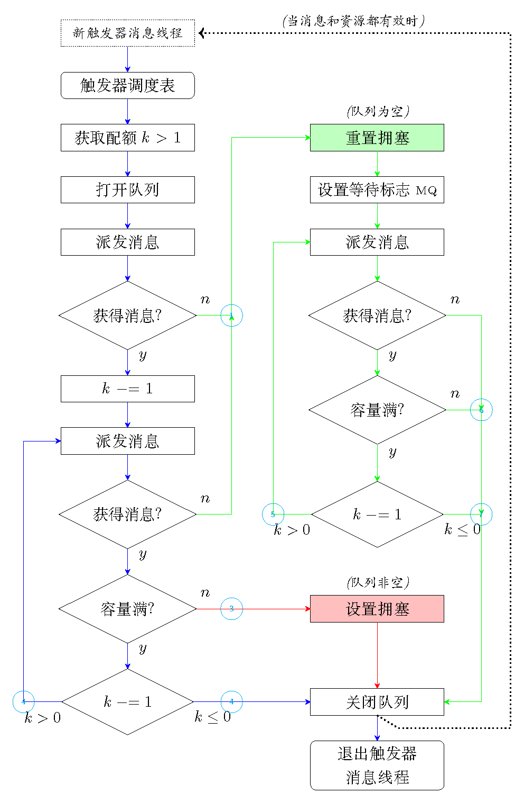

# tikz-flowchat

## 简介
这是一个使用TiKZ绘制传统程序流程图的简单宏包，通过定义`proc`、`test`、`io`、`term`等`node`样式实现。该宏包核心代码摘录自[Brent Longborough](http://www.texample.net/tikz/examples/author/brent-longborough/)设计的流程图绘制样例，参考了tikz-imagelabels宏包的设计思路，提供了`\flowchartset`命令以设置绘制参数。

Happy LaTeXing！~




## 使用方法
1. `\flowchartset`命令
`\flowchartset`命令用于设置绘制参数，详细说明如下：

```
% 各绘图参数及其默认值
\flowchartset{
  free color = green,                % 自由连线颜色(默认取green)
  norm color = blue,                 % 常规连线颜色(默认取blue)
  cong color = red,                  % 关联连线颜色(默认取red)
  proc fill color = white,           % 顺序处理框填充颜色(默认取白色)
  test fill color = white,           % 判断框填充颜色(默认取白色)
  io fill color = white,             % 输入/输出框填充颜色(默认取白色)
  term fill color = white,           % 开始/结束框填充颜色(默认取白色)
  proc text width = 8em,             % 顺序处理框宽度(默认取8em)
  test text width = 5em,             % 判断框宽度(默认取5em)
  io text width = 6em,               % 输入/输出框宽度(默认取6em)
  term text width = 3em,             % 开始/结束宽度(默认取3em)
  chain direction = below,           % 结点自动布置方向(默认取below)
  minimum node distance = 6mm,       % 最小结点间距(默认取6mm)
  maximum node distance = 60mm,      % 最大结点间距(默认取60mm)
  border line width = \pgflinewidth, % 各类流程框边框宽度(默认取当前线条宽度)
  flow line width = \pgflinewidth,   % 各类流程线线条宽度(默认取当前线条宽度)
  stealth length = 1.5mm,            % 箭头长度(默认取1.5mm)
  stealth width = 1.0mm,             % 箭头宽度(默认取1.0mm)
}

```
该命令允许仅指定需要的参数，可以放在导言区进行全局设置，也可以根据需要放在需要的地方进行局部设置。

2. 在`tikzpicture`环境中使用类似`\node [proc, join] (p1) {$k -= 1$};`的命令采用`proc`、`test`、`io`或`term`node样式参数布置需要的流程框结点。布置结点时，如果前一个结点不是`test`样式，则可以在`\node`命令中采用`join`参数自动与前一个结点建立连接并绘制流程线。可以根据需要对布置的结点进行命名，以便后续结点或连接点进行引用。*注意*：可以在`\node`命令中使用其它所有合法的参数。

3. 在`tikzpicture`环境中使用类似`\node [coord, right=0.8 of t1] (c1)  {}; \cmark{1}`命令采用`coord`node样式布置其它需要的坐标点(用于流程线的转接)。同时，可以用`\cmark`命令为该点作出标记，以方便流程线连线调试。该标记在使用`debug`可选参数引入`\usepackage[debug]{tikz-flowchart}`宏包时，将进行绘制，若引入宏包时无`debug`可选参数，则不绘制该标记点。*注意*：可以在`\node`命令中使用其它所有合法的参数。

4. 在`tikzpicture`环境中使用类似`\path (t1.south) to node [near start, xshift=1em] {$y$} (p2);`命令进行流程线条件标注，再使用类似`\draw [norm] (t1.south) -- (p2);`命令，用`norm`、`free`或 `cong`node样式绘制指定颜色的带有箭头的流程线。建议先绘制南北方向流程线，再绘制东西方向流程线。*注意*：可以在`\path`、`\draw`命令中使用其它所有合法的参数。

5. 在`tikzpicture`环境中使用其它各类合法TiKZ命令绘制需要的图形。

6. 该宏包还定义了`lnorm`、`lfree`和`lcong`node样式，分别用于绘制指定颜色的无箭头的流程线；`dotnorm`、`dotfree`和`dotcong`node样式，分别用于绘制指定颜色的实心交点；`cdotnorm`、`cdotfree`和`cdotcong`node样式，分别用于绘制指定颜色的空心交点；`connector`node样式，用于绘制流程线链接标记；`connect`draw样式，用于绘制非相交交汇流程线。

7. 绘制样例请参阅main.tex文件中的样例代码及注释说明。

## 注意

1. 本文档要求 TeXLive、MacTeX、MikTeX 不低于 2018 年的发行版，并且尽可能升级到最新，强烈建议使用TeXLive2019。

2. **不支持** [CTeX 套装](http://www.ctex.org/CTeXDownload)。
